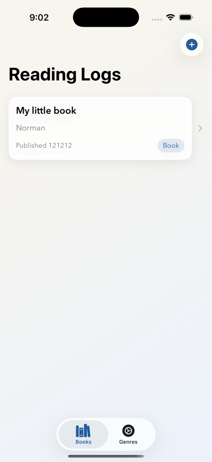
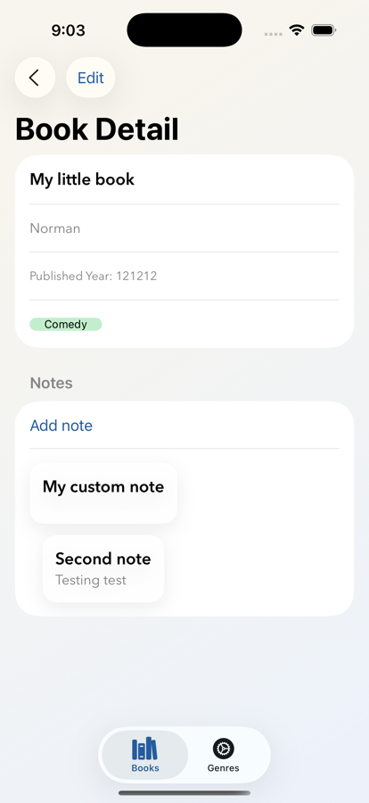
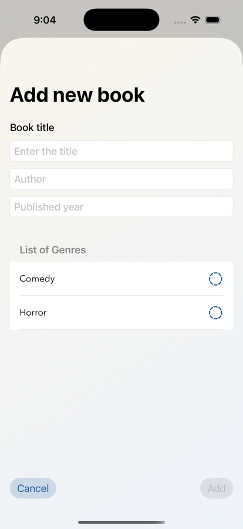
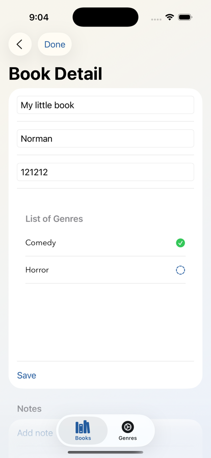

# ReadingLogs

A SwiftUI + SwiftData project that showcases a complete CRUD flow with relationships (Books–Notes–Genres), modern navigation, and a polished UI.

## Purpose

- Demonstrate SwiftData modeling and persistence
- Showcase relationship handling (one-to-many, many-to-many)
- Present clean, production-style SwiftUI screens and flows

## Highlights

- Books list with detail and inline editing
- Genre management and multi-select assignment
- Notes per book
- Local persistence via SwiftData

## Tech Stack

- SwiftUI
- SwiftData
- Xcode (iOS)

## Screenshots

| Book List                               | Book Detail                                 |
| --------------------------------------- | ------------------------------------------- |
|  |  |
| Add Book                                | Edit Book                                   |
|    |      |

## Run Locally

1. Open `ReadingLogs.xcodeproj` in Xcode.
2. Select an iOS simulator.
3. Run.

## Roadmap (Optional)

- Search and filters
- Reading stats
- Export / import
